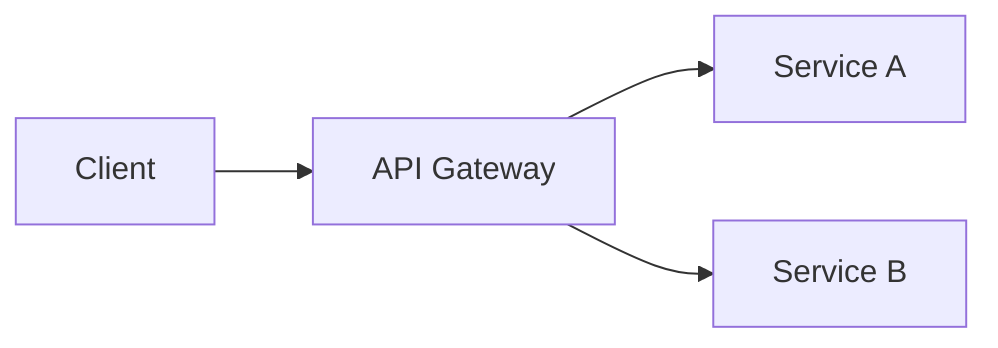

# CLAUDE.md

This file provides guidance to Claude Code when working in this engagement repository.

## Engagement

- **Project:** [Project name]
- **Client:** [Client / organization]
- **Architect:** [Your name]
- **Started:** [YYYY-MM-DD]
- **Scope:** [One paragraph describing what this engagement covers and what is out of scope]

## How to work in this repo

This is an arqqitect engagement repo. The HLD is written as Markdown in `docs/`.
Use the project skills to author and review content:

- `/draft [chapter]` — interview mode: AI asks chapter-appropriate questions and drafts Markdown
- `/review [chapter | all]` — AI reviews content for gaps, inconsistencies, and risks
- `/generate-slides` — AI reads all docs/ and produces a Marp slide deck in output/slides/

## Branching

Work on feature branches per chapter: `draft/07-security`, `draft/04-application`, etc.
Open a PR for each chapter when ready for human review.

## Diagrams

Use Mermaid for all architecture diagrams. Embed diagrams inline in Markdown files.

Example:



## Engineering specs

When a section of the architecture defines a discrete engineering task, create a spec file
named `<component>-spec.md` in the relevant chapter folder. The CI pipeline will collect
these into `output/specs/` on every merge to main.

Spec file format:

```markdown
---
id: spec-<unique-id>
title: <Feature or component title>
status: draft
priority: high | medium | low
components: [<component-name>]
---

## Problem Statement
[What problem does this solve?]

## Acceptance Criteria
- [ ] [Specific, testable criterion]

## Technical Constraints
[Any architectural constraints the engineering team must respect]
```

## Output

- `output/pdf/` — rendered PDF (CI, do not commit manually)
- `output/slides/` — Marp slide Markdown (committed) and rendered HTML (CI, gitignored)
- `output/specs/` — collected engineering specs (CI artifact, do not commit manually)
