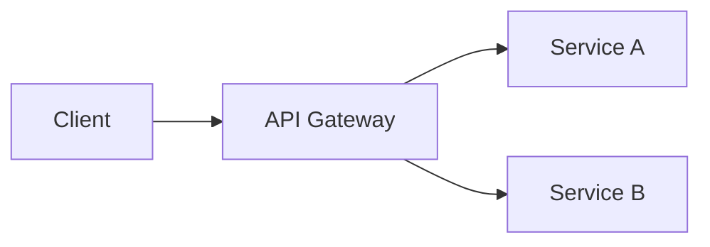

# arqqitect Implementation Plan

> **For agentic workers:** REQUIRED SUB-SKILL: Use superpowers:subagent-driven-development (recommended) or superpowers:executing-plans to implement this plan task-by-task. Steps use checkbox (`- [ ]`) syntax for tracking.

**Goal:** Build arqqitect — a GitHub template repository for AI-assisted architecture documentation that produces HLD documents, slides, and engineering specs.

**Architecture:** One repo is forked per engagement. AI behavior lives in `.claude/skills/` as project-local skills picked up automatically by Claude Code. CI workflows handle deterministic rendering (PDF via pandoc, slides via Marp). The `scripts/generate-specs.sh` script collects engineering spec files from `docs/`. Everything else is Markdown, GitHub Actions, and Bash.

**Tech Stack:** Bash, GitHub Actions, pandoc + xelatex (PDF), Marp CLI (slides), Markdown + YAML frontmatter, Mermaid (diagrams)

---

## File Map

Files to create (all paths relative to repo root):

| File | Purpose |
|---|---|
| `.gitignore` | Ignore generated binaries and .superpowers/ |
| `output/pdf/.gitkeep` | Hold output/pdf/ in git |
| `output/slides/.gitkeep` | Hold output/slides/ in git |
| `output/specs/.gitkeep` | Hold output/specs/ in git |
| `docs/00-introduction/README.md` | Chapter skeleton: document control + intro |
| `docs/01-context/README.md` | Chapter skeleton: business context |
| `docs/02-requirements/README.md` | Chapter skeleton: functional/NFR/security reqs |
| `docs/03-integration/README.md` | Chapter skeleton: integration architecture |
| `docs/04-application/README.md` | Chapter skeleton: application architecture |
| `docs/05-infrastructure/README.md` | Chapter skeleton: infrastructure |
| `docs/06-data/README.md` | Chapter skeleton: data architecture |
| `docs/07-security/README.md` | Chapter skeleton: security |
| `docs/08-deployment/README.md` | Chapter skeleton: deployment |
| `docs/09-operations/README.md` | Chapter skeleton: operations |
| `docs/10-raid/README.md` | Chapter skeleton: risks/assumptions/issues/decisions |
| `docs/11-appendices/README.md` | Chapter skeleton: appendices |
| `CLAUDE.md` | Engagement template with AI instructions (modify existing) |
| `.github/pull_request_template.md` | Review checklist for human reviewers |
| `scripts/generate-specs.sh` | Collect *-spec.md files → output/specs/ |
| `.github/workflows/render-pdf.yml` | CI: pandoc → output/pdf/ on merge to main |
| `.github/workflows/render-slides.yml` | CI: Marp → slides HTML on merge to main |
| `.github/workflows/generate-specs.yml` | CI: run generate-specs.sh, upload artifact |
| `.claude/skills/draft.md` | AI skill: interview + draft a chapter |
| `.claude/skills/review.md` | AI skill: review chapter(s) for gaps/risks |
| `.claude/skills/generate-slides.md` | AI skill: build slide narrative from docs/ |
| `README.md` | How to use arqqitect |

---

## Task 1: Folder scaffold and .gitignore

**Files:**
- Create: `.gitignore`
- Create: `output/pdf/.gitkeep`
- Create: `output/slides/.gitkeep`
- Create: `output/specs/.gitkeep`

- [ ] **Step 1: Create .gitignore**

```
# Generated rendering artifacts — produced by CI, not committed
output/pdf/*.pdf
output/slides/*.html
output/slides/*.pdf

# Brainstorm session files
.superpowers/
```

Write this to `.gitignore`.

- [ ] **Step 2: Create output directory placeholders**

```bash
mkdir -p output/pdf output/slides output/specs
touch output/pdf/.gitkeep output/slides/.gitkeep output/specs/.gitkeep
```

- [ ] **Step 3: Verify**

```bash
ls output/pdf output/slides output/specs
# Expected: each directory contains .gitkeep
```

- [ ] **Step 4: Commit**

```bash
git add .gitignore output/
git commit -m "chore: scaffold output directories and gitignore"
```

---

## Task 2: Chapter README skeletons

**Files:**
- Create: `docs/00-introduction/README.md` through `docs/11-appendices/README.md`

- [ ] **Step 1: Create docs/00-introduction/README.md**

```markdown
# 00 — Introduction

Document control and project introduction.

## Expected files

- `overview.md` — project name, client, scope, purpose, out-of-scope
- `authors.md` — authors, version history, contributors, approvals, outstanding decisions
- `principles.md` — key design principles for this engagement

## Start here

Run `/draft` to be interviewed and have these files drafted for you.
```

- [ ] **Step 2: Create docs/01-context/README.md**

```markdown
# 01 — Context

Business context, drivers, and dependencies.

## Expected files

- `business-context.md` — business reasons, strategic drivers, opportunities
- `dependencies.md` — dependencies on other systems, projects, or teams

## Start here

Run `/draft` to be interviewed and have these files drafted for you.
```

- [ ] **Step 3: Create docs/02-requirements/README.md**

```markdown
# 02 — Requirements

Functional, non-functional, and security requirements.

## Expected files

- `functional.md` — what the system must do
- `non-functional.md` — performance, scalability, availability, reliability targets
- `security-requirements.md` — security-specific requirements and compliance obligations

## Start here

Run `/draft` to be interviewed and have these files drafted for you.
```

- [ ] **Step 4: Create docs/03-integration/README.md**

```markdown
# 03 — Integration

Integration architecture with external systems.

## Expected files

- `overview.md` — integration landscape diagram and narrative
- One file per major integration (e.g. `salesforce.md`, `sap.md`)

Each integration file covers: protocol, data exchanged, direction, SLA, error handling.

## Start here

Run `/draft` to be interviewed and have these files drafted for you.
```

- [ ] **Step 5: Create docs/04-application/README.md**

```markdown
# 04 — Application Architecture

Services, APIs, components, and technology stack.

## Expected files

- `overview.md` — application architecture diagram and narrative
- `services.md` — service inventory: responsibilities and interfaces
- `api.md` — internal and external API design
- `auth.md` — authentication and authorization model

## Start here

Run `/draft` to be interviewed and have these files drafted for you.
```

- [ ] **Step 6: Create docs/05-infrastructure/README.md**

```markdown
# 05 — Infrastructure

Cloud infrastructure, networking, and environments.

## Expected files

- `overview.md` — infrastructure architecture diagram and narrative
- `compute.md` — compute resources (VMs, Kubernetes, serverless, managed services)
- `network.md` — network topology (VPCs, subnets, peering, on-premises connectivity)
- `environments.md` — environment tiers (dev, test, staging, prod) and HA/DR approach

## Start here

Run `/draft` to be interviewed and have these files drafted for you.
```

- [ ] **Step 7: Create docs/06-data/README.md**

```markdown
# 06 — Data Architecture

Data model, data flow, storage, and data management.

## Expected files

- `overview.md` — data architecture diagram and narrative
- `data-model.md` — entities, relationships, and data stores
- `data-flow.md` — how data moves between components
- `data-management.md` — retention, backup, recovery, residency requirements

## Start here

Run `/draft` to be interviewed and have these files drafted for you.
```

- [ ] **Step 8: Create docs/07-security/README.md**

```markdown
# 07 — Security

Security architecture, controls, and compliance.

## Expected files

- `overview.md` — security architecture overview and principles
- `iam.md` — identity and access management (roles, groups, federation)
- `secrets.md` — secrets and certificate management
- `data-protection.md` — data classification and protection controls
- `monitoring.md` — security monitoring and alerting
- `compliance.md` — compliance framework alignment
- `risks.md` — security-specific risks

## Start here

Run `/draft` to be interviewed and have these files drafted for you.
```

- [ ] **Step 9: Create docs/08-deployment/README.md**

```markdown
# 08 — Deployment

CI/CD pipeline, release management, and deployment procedures.

## Expected files

- `pipeline.md` — CI/CD pipeline stages and gates
- `release.md` — release management and versioning approach
- `team.md` — deployment team skills and responsibilities
- `steps.md` — ordered deployment steps

## Start here

Run `/draft` to be interviewed and have these files drafted for you.
```

- [ ] **Step 10: Create docs/09-operations/README.md**

```markdown
# 09 — Operations

Monitoring, alerting, SLAs, and logging.

## Expected files

- `monitoring.md` — infrastructure and application monitoring tools and dashboards
- `alerting.md` — alerting thresholds and on-call procedures
- `sla.md` — SLAs and SLOs
- `logging.md` — logging strategy, retention, and aggregation

## Start here

Run `/draft` to be interviewed and have these files drafted for you.
```

- [ ] **Step 11: Create docs/10-raid/README.md**

```markdown
# 10 — RAID

Risks, Assumptions, Issues, and Decisions (Architecture Decision Records).

## Expected files

- `risks.md` — risk register: likelihood, impact, mitigation per risk
- `assumptions.md` — assumption log
- `issues.md` — issue log (also receives output from `/review`)
- `decisions.md` — architecture decision records (ADRs): context, decision, rationale

## Start here

Run `/draft` to be interviewed and have these files drafted for you.
```

- [ ] **Step 12: Create docs/11-appendices/README.md**

```markdown
# 11 — Appendices

Glossary, references, and supplementary material.

## Expected files

- `glossary.md` — terms, abbreviations, and acronyms
- `references.md` — reference documents and standards
- `licensing.md` — software licensing requirements and risks (if applicable)

## Start here

Run `/draft` to be interviewed and have these files drafted for you.
```

- [ ] **Step 13: Verify**

```bash
find docs -name "README.md" | sort
# Expected: 12 files, one per chapter (00 through 11)
```

- [ ] **Step 14: Commit**

```bash
git add docs/
git commit -m "feat: add chapter README skeletons for all 12 HLD chapters"
```

---

## Task 3: CLAUDE.md engagement template

**Files:**
- Modify: `CLAUDE.md`

- [ ] **Step 1: Replace CLAUDE.md with the engagement template**

```markdown
# CLAUDE.md

This file provides guidance to Claude Code when working in this engagement repository.

## Engagement

- **Project:** [Project name]
- **Client:** [Client / organization]
- **Architect:** [Your name]
- **Started:** [YYYY-MM-DD]
- **Scope:** [One paragraph describing what this engagement covers and what is out of scope]

## How to work in this repo

This is an arqqitect engagement repo. The HLD is written as Markdown in `docs/`.
Use the project skills to author and review content:

- `/draft [chapter]` — interview mode: AI asks chapter-appropriate questions and drafts Markdown
- `/review [chapter | all]` — AI reviews content for gaps, inconsistencies, and risks
- `/generate-slides` — AI reads all docs/ and produces a Marp slide deck in output/slides/

## Branching

Work on feature branches per chapter: `draft/07-security`, `draft/04-application`, etc.
Open a PR for each chapter when ready for human review.

## Diagrams

Use Mermaid for all architecture diagrams. Embed diagrams inline in Markdown files.

Example:


## Engineering specs

When a section of the architecture defines a discrete engineering task, create a spec file
named `<component>-spec.md` in the relevant chapter folder. The CI pipeline will collect
these into `output/specs/` on every merge to main.

Spec file format:

```markdown
---
id: spec-<unique-id>
title: <Feature or component title>
status: draft
priority: high | medium | low
components: [<component-name>]
---

## Problem Statement
[What problem does this solve?]

## Acceptance Criteria
- [ ] [Specific, testable criterion]

## Technical Constraints
[Any architectural constraints the engineering team must respect]
```

## Output

- `output/pdf/` — rendered PDF (CI, do not commit manually)
- `output/slides/` — Marp slide Markdown (committed) and rendered HTML (CI, gitignored)
- `output/specs/` — collected engineering specs (CI artifact)
```

- [ ] **Step 2: Verify the file renders cleanly**

```bash
cat CLAUDE.md
# Skim for broken Markdown (unclosed fences, misaligned headers)
```

- [ ] **Step 3: Commit**

```bash
git add CLAUDE.md
git commit -m "feat: update CLAUDE.md with engagement template and skill documentation"
```

---

## Task 4: Pull request template

**Files:**
- Create: `.github/pull_request_template.md`

- [ ] **Step 1: Create .github/pull_request_template.md**

```markdown
## Chapter

<!-- Which chapter does this PR cover? e.g. 07-security -->

## Summary

<!-- 2-3 sentences on what was drafted or changed -->

## AI self-review done?

- [ ] Ran `/review [chapter]` before opening this PR
- [ ] Issues found by `/review` are addressed or logged in `10-raid/issues.md`

## Reviewer checklist

- [ ] Content is accurate and complete for this chapter
- [ ] Diagrams are clear and correctly represent the architecture
- [ ] No sensitive information (credentials, internal IPs, personal data) included
- [ ] Security implications have been considered (if applicable)
- [ ] Consistent with decisions logged in `10-raid/decisions.md`
```

- [ ] **Step 2: Verify directory exists**

```bash
ls .github/
# Expected: pull_request_template.md
```

- [ ] **Step 3: Commit**

```bash
git add .github/pull_request_template.md
git commit -m "feat: add PR template with reviewer checklist"
```

---

## Task 5: generate-specs.sh

**Files:**
- Create: `scripts/generate-specs.sh`

- [ ] **Step 1: Create scripts/generate-specs.sh**

```bash
#!/usr/bin/env bash
# Collects *-spec.md files from docs/ into output/specs/.
# Architects create spec files named <component>-spec.md within any chapter folder.
set -euo pipefail

DOCS_DIR="${1:-docs}"
OUTPUT_DIR="${2:-output/specs}"

mkdir -p "$OUTPUT_DIR"

count=0
while IFS= read -r -d '' file; do
    filename=$(basename "$file")
    cp "$file" "$OUTPUT_DIR/$filename"
    echo "Collected: $filename"
    ((count++))
done < <(find "$DOCS_DIR" -name "*-spec.md" -print0 | sort -z)

echo "Done. $count spec file(s) written to $OUTPUT_DIR"
```

- [ ] **Step 2: Make it executable**

```bash
chmod +x scripts/generate-specs.sh
```

- [ ] **Step 3: Test with a sample spec file**

```bash
# Create a fixture
mkdir -p /tmp/arqqitect-test/04-application
cat > /tmp/arqqitect-test/04-application/auth-spec.md << 'EOF'
---
id: spec-auth-001
title: User Authentication
status: draft
priority: high
components: [auth-service]
---

## Problem Statement
Users need to authenticate securely.

## Acceptance Criteria
- [ ] Users can log in with email and password

## Technical Constraints
- Must use OAuth 2.0
EOF

# Run the script
bash scripts/generate-specs.sh /tmp/arqqitect-test /tmp/arqqitect-test-output

# Verify
test -f /tmp/arqqitect-test-output/auth-spec.md && echo "PASS: spec file collected"
grep "id: spec-auth-001" /tmp/arqqitect-test-output/auth-spec.md && echo "PASS: frontmatter preserved"

# Cleanup
rm -rf /tmp/arqqitect-test /tmp/arqqitect-test-output
```

Expected output:
```
Collected: auth-spec.md
Done. 1 spec file(s) written to /tmp/arqqitect-test-output
PASS: spec file collected
PASS: frontmatter preserved
```

- [ ] **Step 4: Verify the script handles zero spec files gracefully**

```bash
mkdir -p /tmp/empty-test
bash scripts/generate-specs.sh /tmp/empty-test /tmp/empty-output
# Expected: "Done. 0 spec file(s) written to /tmp/empty-output"
rm -rf /tmp/empty-test /tmp/empty-output
```

- [ ] **Step 5: Commit**

```bash
git add scripts/generate-specs.sh
git commit -m "feat: add generate-specs.sh to collect engineering spec files"
```

---

## Task 6: GitHub Actions — render-pdf

**Files:**
- Create: `.github/workflows/render-pdf.yml`

- [ ] **Step 1: Create .github/workflows/render-pdf.yml**

```yaml
name: Render PDF

on:
  push:
    branches: [main]
    paths:
      - 'docs/**'

jobs:
  render-pdf:
    runs-on: ubuntu-latest
    steps:
      - uses: actions/checkout@v4

      - name: Install pandoc and LaTeX
        run: |
          sudo apt-get update -qq
          sudo apt-get install -y pandoc texlive-xetex texlive-fonts-recommended

      - name: Collect Markdown files
        id: collect
        run: |
          files=$(find docs -name "*.md" | sort | tr '\n' ' ')
          echo "files=$files" >> "$GITHUB_OUTPUT"

      - name: Render PDF
        run: |
          mkdir -p output/pdf
          pandoc ${{ steps.collect.outputs.files }} \
            --output output/pdf/hld.pdf \
            --pdf-engine=xelatex \
            --toc \
            --toc-depth=3 \
            --variable geometry:margin=2.5cm

      - name: Upload PDF artifact
        uses: actions/upload-artifact@v4
        with:
          name: hld-pdf
          path: output/pdf/hld.pdf
          retention-days: 90
```

- [ ] **Step 2: Validate YAML syntax**

```bash
python3 -c "import yaml; yaml.safe_load(open('.github/workflows/render-pdf.yml'))" && echo "PASS: valid YAML"
```

- [ ] **Step 3: Commit**

```bash
git add .github/workflows/render-pdf.yml
git commit -m "feat: add CI workflow to render HLD PDF with pandoc"
```

---

## Task 7: GitHub Actions — render-slides and generate-specs

**Files:**
- Create: `.github/workflows/render-slides.yml`
- Create: `.github/workflows/generate-specs.yml`

- [ ] **Step 1: Create .github/workflows/render-slides.yml**

```yaml
name: Render Slides

on:
  push:
    branches: [main]
    paths:
      - 'output/slides/*.md'

jobs:
  render-slides:
    runs-on: ubuntu-latest
    steps:
      - uses: actions/checkout@v4

      - name: Install Marp CLI
        run: npm install -g @marp-team/marp-cli

      - name: Render slides
        run: |
          for f in output/slides/*.md; do
            marp "$f" --html --output "${f%.md}.html"
          done

      - name: Upload slides artifact
        uses: actions/upload-artifact@v4
        with:
          name: slides-html
          path: output/slides/*.html
          retention-days: 90
```

- [ ] **Step 2: Create .github/workflows/generate-specs.yml**

```yaml
name: Generate Engineering Specs

on:
  push:
    branches: [main]
    paths:
      - 'docs/**/*-spec.md'

jobs:
  generate-specs:
    runs-on: ubuntu-latest
    steps:
      - uses: actions/checkout@v4

      - name: Run generate-specs.sh
        run: bash scripts/generate-specs.sh

      - name: Upload specs artifact
        uses: actions/upload-artifact@v4
        with:
          name: engineering-specs
          path: output/specs/
          retention-days: 90
```

- [ ] **Step 3: Validate both YAML files**

```bash
python3 -c "import yaml; yaml.safe_load(open('.github/workflows/render-slides.yml'))" && echo "PASS: render-slides.yml valid"
python3 -c "import yaml; yaml.safe_load(open('.github/workflows/generate-specs.yml'))" && echo "PASS: generate-specs.yml valid"
```

- [ ] **Step 4: Commit**

```bash
git add .github/workflows/render-slides.yml .github/workflows/generate-specs.yml
git commit -m "feat: add CI workflows for slides rendering and spec collection"
```

---

## Task 8: Skill — draft

**Files:**
- Create: `.claude/skills/draft.md`

- [ ] **Step 1: Create .claude/skills/ directory**

```bash
mkdir -p .claude/skills
```

- [ ] **Step 2: Create .claude/skills/draft.md**

```markdown
# arqqitect: Draft

Help the architect draft a chapter of the HLD by conducting a structured interview and writing Markdown files into the chapter folder.

## Step 1 — Identify the chapter

Check `$ARGUMENTS` first. If a chapter identifier is provided (e.g. `07-security`), use it.
Otherwise check the current working directory for a chapter folder name.
If neither is clear, ask: "Which chapter do you want to draft? (e.g. 04-application)"

## Step 2 — Interview the architect

Ask one question at a time. Wait for the answer before asking the next.
Use the question set for the identified chapter below.

### 00-introduction
1. What is the project name and any internal code name?
2. Who is the client or organization?
3. What does this engagement cover, and what is explicitly out of scope?
4. Who is the target audience for this document? (e.g. technical leads, security team, executives)
5. Who are the authors and contributors?
6. What are the key design principles guiding this engagement? (e.g. cloud-native, zero-trust, API-first)

### 01-context
1. What business problem or opportunity is this solution addressing?
2. What are the key business drivers? (e.g. cost reduction, compliance, time-to-market, growth)
3. What existing systems does this solution depend on, integrate with, or replace?
4. Who are the key stakeholders and what are their main concerns?
5. What is the expected delivery timeline and key milestones?

### 02-requirements
1. What are the functional requirements? List the key things the system must do.
2. What are the performance requirements? (throughput, latency, concurrent users)
3. What are the availability and reliability requirements? (uptime SLA, RTO, RPO)
4. What compliance or regulatory standards apply? (e.g. ISO 27001, GDPR, PCI DSS, SOC 2)
5. What are the specific security requirements beyond compliance? (e.g. MFA, encryption at rest, network isolation)

### 03-integration
1. What external systems does this solution integrate with?
2. For each integration: what protocol (REST, gRPC, event, batch, SFTP), what data, in which direction, and what SLA?
3. Are integrations synchronous or asynchronous? Event-driven or request-response?
4. How are integration failures handled? (retry, dead-letter queue, circuit breaker, manual remediation)
5. Is there an API gateway or ESB in the integration layer?

### 04-application
1. What are the main application services or components and what does each do?
2. What is the technology stack? (languages, frameworks, runtimes)
3. How are services deployed? (containers on Kubernetes, serverless functions, VMs, managed PaaS)
4. What are the key internal APIs between services, and the external APIs exposed to consumers?
5. What authentication and authorization model is used? (OAuth 2.0, OIDC, RBAC, ABAC, API keys)
6. What are the main scalability and resilience mechanisms? (horizontal scaling, circuit breakers, caching)

### 05-infrastructure
1. What cloud provider and target region(s)?
2. What compute resources? (VM sizes, Kubernetes cluster spec, serverless platforms, managed services used)
3. What is the network topology? (VPC/VNet design, subnets, peering, ExpressRoute/Direct Connect, on-premises connectivity)
4. What are the HA and DR requirements and how are they met? (multi-AZ, multi-region, failover approach)
5. What environment tiers exist and how do they differ? (dev, test, staging, prod — size, data, access)

### 06-data
1. What are the main data entities and their relationships?
2. What data stores are used? (relational DB, NoSQL, object storage, cache, search, data warehouse)
3. How does data flow between components? Describe the main data paths.
4. What are the data retention and archiving requirements?
5. What are the backup and recovery requirements? (RPO, RTO, backup frequency, restore testing)
6. Are there data residency or sovereignty requirements? (data must stay in specific country/region)

### 07-security
1. What IAM model is used? (cloud-native roles, groups, service accounts, federated identity, PAM)
2. How are TLS certificates managed and rotated? (internal CA, public CA, cert-manager, manual)
3. How are secrets and credentials managed? (vault solution, cloud secrets manager, rotation policy)
4. What data classification applies and how is sensitive data protected at rest and in transit?
5. What vulnerability management approach is used? (scanning tools, patching cadence, DAST/SAST)
6. What security monitoring and alerting is in place? (SIEM, anomaly detection, threat detection)
7. What compliance frameworks apply and how is alignment demonstrated? (ISO 27001, SOC 2, PCI DSS)

### 08-deployment
1. What does the CI/CD pipeline look like? (tools, stages, approval gates, environment promotion)
2. What is the release management approach? (versioning scheme, change management process)
3. What are the rollback procedures if a deployment fails?
4. What team skills and responsibilities are required to operate the deployment pipeline?
5. Walk me through the deployment steps in order.

### 09-operations
1. What monitoring tools are used for infrastructure, application, and security?
2. What metrics are tracked? What are the alerting thresholds and who gets paged?
3. What is the on-call and incident response process?
4. What SLAs and SLOs apply to this solution?
5. What is the logging strategy? (log aggregation platform, retention policy, access controls)

### 10-raid
1. What are the key risks? For each: likelihood (H/M/L), impact (H/M/L), and mitigation.
2. What assumptions has the design made that may not hold?
3. What issues or decisions are still outstanding?
4. What architectural decisions have been made? For each ADR: context, options considered, decision, and rationale.

### 11-appendices
1. What terms, abbreviations, or acronyms need defining for the target audience?
2. What reference documents or standards should be listed?
3. Are there any software licensing requirements or risks to document?

## Step 3 — Draft the Markdown files

Based on the interview answers, draft the appropriate files into the chapter folder.
Create one file per major concern (see each chapter's README.md for expected filenames).
Use Mermaid diagrams where they add clarity — architecture diagrams, data flows, sequence diagrams.
Write in clear, professional English. Be specific — avoid vague statements like "the system will be secure."

## Step 4 — Confirm

List the files created. Tell the architect: "Review the drafts, make edits, then commit to a branch:
`git checkout -b draft/<chapter>` and open a PR."
```

- [ ] **Step 3: Verify the file is in place**

```bash
ls .claude/skills/
# Expected: draft.md
```

- [ ] **Step 4: Smoke-test by invoking the skill on the 00-introduction chapter**

Open Claude Code in this repo and run:
```
/draft 00-introduction
```
Verify that Claude asks the first question from the `00-introduction` set: "What is the project name and any internal code name?"

- [ ] **Step 5: Commit**

```bash
git add .claude/skills/draft.md
git commit -m "feat: add arqqitect:draft skill for chapter interview and drafting"
```

---

## Task 9: Skill — review

**Files:**
- Create: `.claude/skills/review.md`

- [ ] **Step 1: Create .claude/skills/review.md**

```markdown
# arqqitect: Review

Review one chapter or all chapters of the HLD for gaps, inconsistencies, and risks.
Write findings to `docs/10-raid/issues.md`.

## Step 1 — Determine scope

Check `$ARGUMENTS`:
- If a chapter identifier is provided (e.g. `07-security`), review that chapter only.
- If `all` is provided, review all chapters in `docs/`.
- If nothing is provided, ask: "Review one chapter or all? If one chapter, which?"

## Step 2 — Read the content

Read all Markdown files in the target chapter folder(s).
If reviewing `all`, read all files in `docs/` before forming any findings.

## Step 3 — Identify findings

For each chapter reviewed, identify:

**Gaps** — Content that is expected for this chapter but missing or too vague to be useful.
Use each chapter's README.md as the reference for what is expected.
Flag: incomplete sections, placeholder text, missing diagrams, unexplained acronyms.

**Inconsistencies** — Conflicts between chapters.
Examples: security chapter mentions IAM approach X, but application chapter assumes approach Y.
Data chapter defines retention as 90 days, operations chapter references 30 days.

**Risks** — Decisions or omissions that introduce architectural risk.
Examples: no DR strategy defined, single point of failure not acknowledged, compliance requirement with no control mapped.

## Step 4 — Write findings to 10-raid/issues.md

Append findings to `docs/10-raid/issues.md`. If the file does not exist, create it.

Format each finding as:

```markdown
## [YYYY-MM-DD] Review finding: <short title>

**Type:** Gap | Inconsistency | Risk
**Chapter:** <chapter folder name>
**Finding:** <One paragraph describing the issue specifically — reference the exact section or file>
**Suggested action:** <What the architect should do to resolve this>
**Status:** Open
```

## Step 5 — Summarise

After writing all findings, print a summary:
- Total findings by type (gaps / inconsistencies / risks)
- Which chapters have the most issues
- Recommended priority order for fixing them
```

- [ ] **Step 2: Verify**

```bash
ls .claude/skills/
# Expected: draft.md  review.md
```

- [ ] **Step 3: Smoke-test by invoking the skill**

Open Claude Code in this repo and run:
```
/review 00-introduction
```
With an empty `docs/00-introduction/` folder (only README.md), verify Claude reports gaps for the missing files (`overview.md`, `authors.md`, `principles.md`) and writes a finding to `docs/10-raid/issues.md`.

- [ ] **Step 4: Commit**

```bash
git add .claude/skills/review.md
git commit -m "feat: add arqqitect:review skill for gap and risk analysis"
```

---

## Task 10: Skill — generate-slides

**Files:**
- Create: `.claude/skills/generate-slides.md`

- [ ] **Step 1: Create .claude/skills/generate-slides.md**

```markdown
# arqqitect: Generate Slides

Read all content in `docs/` and produce a Marp-formatted slide deck in `output/slides/slides.md`.

## Step 1 — Read the full HLD

Read all Markdown files in `docs/` (all chapters). Build a mental model of:
- The core story: what problem, what solution, why this approach
- The key architectural decisions and their rationale
- The main components and how they fit together
- The risks and how they are mitigated

## Step 2 — Determine the audience

Check `$ARGUMENTS` for an audience hint:
- `executive` — focus on business value, risks, costs; minimal technical detail
- `technical` — focus on architecture, components, decisions, integrations
- `security` — focus on security architecture, controls, compliance
- If no argument, default to `technical`

## Step 3 — Plan the narrative

Before writing slides, plan the story arc:
1. Context and problem statement (why)
2. Solution overview (what)
3. Architecture (how — adjust depth to audience)
4. Key decisions and trade-offs
5. Risks and mitigations
6. Next steps

Aim for 20–35 slides. Fewer is better — each slide should make one clear point.

## Step 4 — Write the Marp slide deck

Write a Marp-formatted Markdown file to `output/slides/slides.md`.

Marp format rules:
- Start with the YAML frontmatter block
- Separate slides with `---`
- Use `# ` for slide titles
- Keep text minimal — diagrams and bullet points, not paragraphs
- Embed Mermaid diagrams directly in slides where useful

```markdown
---
marp: true
theme: default
paginate: true
---

# [Project Name]
## High Level Design

[Client] | [Date]

---

# Agenda

- Context
- Solution Overview
- Architecture
- Key Decisions
- Risks
- Next Steps

---

# [Next slide title]

[Content]
```

## Step 5 — Confirm

Tell the architect: "Slide deck written to `output/slides/slides.md` — [N] slides.
Review the file, make edits, then commit. CI will render it to HTML on merge to main.
To re-generate, run `/generate-slides [executive|technical|security]`."
```

- [ ] **Step 2: Verify**

```bash
ls .claude/skills/
# Expected: draft.md  generate-slides.md  review.md
```

- [ ] **Step 3: Smoke-test by invoking the skill**

Open Claude Code in this repo and run:
```
/generate-slides technical
```
With docs/ containing only the chapter README skeletons, verify Claude generates `output/slides/slides.md` with valid Marp frontmatter (`marp: true`) and at least a title slide and agenda slide.

- [ ] **Step 4: Commit**

```bash
git add .claude/skills/generate-slides.md
git commit -m "feat: add arqqitect:generate-slides skill for Marp slide deck generation"
```

---

## Task 11: README.md

**Files:**
- Create: `README.md`

- [ ] **Step 1: Create README.md**

```markdown
# arqqitect

Architecture documentation as code. AI-assisted authoring, human review via pull requests, generated outputs (PDF, slides, engineering specs).

## Prerequisites

- [Claude Code](https://claude.ai/code)
- [GitHub CLI](https://cli.github.com/) (`gh`)
- A GitHub account

## Start a new engagement

**1. Fork this template**

```bash
gh repo create my-engagement-hld \
  --template qsanchez/arqqitect \
  --private \
  --clone
cd my-engagement-hld
```

**2. Open in Claude Code and fill in engagement metadata**

Edit `CLAUDE.md` — replace the placeholder values (project name, client, scope).

**3. Start drafting**

```
/draft 01-context
```

Claude will ask you questions about the business context and draft `docs/01-context/` for you.
Repeat for each chapter you want to cover.

## Authoring workflow

```
/draft [chapter]          Interview + draft a chapter
/review [chapter | all]   Review content: gaps, inconsistencies, risks
/generate-slides          Build a Marp slide deck from all docs/
```

After drafting a chapter:

1. Review and edit the generated Markdown files
2. Run `/review [chapter]` — findings go to `docs/10-raid/issues.md`
3. `git checkout -b draft/[chapter]`
4. Open a PR — use the PR template checklist to guide reviewers

## CI outputs

On every merge to `main`:

| Trigger | Output | Location |
|---|---|---|
| `docs/**` changes | PDF rendered by pandoc | GitHub Actions artifact |
| `output/slides/*.md` changes | Slides rendered by Marp | GitHub Actions artifact |
| `docs/**/*-spec.md` changes | Engineering specs collected | GitHub Actions artifact |

Download artifacts from the **Actions** tab in GitHub.

## Engineering specs

To hand off work to engineering, create a `<component>-spec.md` file in the relevant chapter folder.
See the spec file format in `CLAUDE.md`. CI collects all `*-spec.md` files into `output/specs/`.

## Toolchain

PDF rendering requires pandoc and xelatex (installed by CI). To render locally:

```bash
sudo apt-get install pandoc texlive-xetex
pandoc $(find docs -name "*.md" | sort) -o output/pdf/hld.pdf --pdf-engine=xelatex --toc
```

Slides rendering requires Marp CLI. To render locally:

```bash
npm install -g @marp-team/marp-cli
marp output/slides/slides.md --html
```
```

- [ ] **Step 2: Verify**

```bash
cat README.md | head -5
# Expected: # arqqitect
```

- [ ] **Step 3: Commit**

```bash
git add README.md
git commit -m "docs: add README with quickstart and workflow guide"
```

---

## Task 12: Mark repo as GitHub template

- [ ] **Step 1: Push all commits to origin**

```bash
git push origin main
```

- [ ] **Step 2: Mark the repo as a GitHub template**

```bash
gh repo edit --template
```

Expected output: no error. Verify at `https://github.com/qsanchez/arqqitect` — the repo header should show "Template repository."

- [ ] **Step 3: Verify template flag is set**

```bash
gh repo view qsanchez/arqqitect --json isTemplate --jq '.isTemplate'
# Expected: true
```

- [ ] **Step 4: Test the template by creating a trial fork**

```bash
gh repo create arqqitect-test-fork \
  --template qsanchez/arqqitect \
  --private \
  --clone
ls arqqitect-test-fork/
# Expected: CLAUDE.md  README.md  docs/  output/  scripts/  .claude/  .github/
```

- [ ] **Step 5: Clean up the test fork**

```bash
gh repo delete arqqitect-test-fork --yes
rm -rf arqqitect-test-fork
```

- [ ] **Step 6: Final push**

```bash
git push origin main
```

arqqitect is complete. Architects can now fork it at `https://github.com/qsanchez/arqqitect`.
